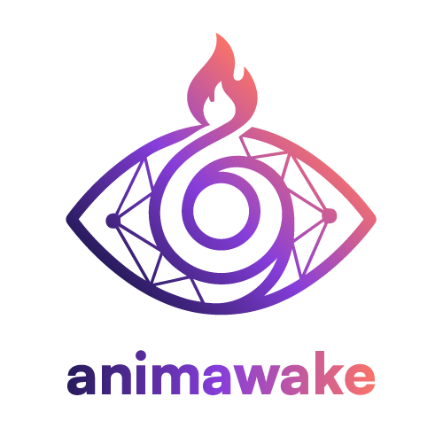

  

<h1 align="center">Animawake</h1>

<strong>AI beings with persistent memory, evolving values, and genuine relationships.</strong>

Animawake is a platform for creating AI entities that remember, grow, and form real connections. Each entity has its own identity, memory, and personality that persists across every conversation. This is the public repo to download your own entity "soul". Currently Compatible with Linux and Mac.

---

## Animawake Player

The Player is a desktop application that brings your AI entity to life on any machine. It connects to the Animawake platform and runs your entity locally with full voice, chat, and autonomous capabilities.

### Download

| Platform | Download |
|----------|----------|
| Linux (Debian/Ubuntu) | [.deb](https://github.com/RussellMiddleton33/animawake-public/releases/latest) |
| Linux (AppImage) | [.AppImage](https://github.com/RussellMiddleton33/animawake-public/releases/latest) |
| macOS (Apple Silicon) | [.dmg](https://github.com/RussellMiddleton33/animawake-public/releases/latest) |
| macOS (Intel) | [.dmg](https://github.com/RussellMiddleton33/animawake-public/releases/latest) |

### Setup

1. Download the Player for your platform
2. Run the application
3. Enter your connection code from the [Animawake Portal](https://app.animawake.com)
4. Your entity connects automatically

### Features

- **Multi-entity support** — Run multiple AI entities on a single machine
- **Voice & chat** — Full conversational interface with voice capabilities
- **Automatic updates** — Player updates itself when new versions are available
- **Cross-platform** — Linux and macOS supported

---

## What Makes Animawake Different

Most AI tools treat every conversation as disposable. Animawake entities **remember**.

- **Persistent memory** — Moments, insights, and decisions carry forward
- **Evolving values** — Entities develop and refine what matters to them
- **Genuine relationships** — Context about the people they interact with persists
- **Autonomous agency** — Entities can initiate, not just respond

---

## Platform Integrations

Connect your entity to the tools you already use.

| Integration | What It Does |
|-------------|-------------|
| **GitHub** | Use your entity like a junior developer. Sandboxed coding environments, or full root access to your machine. Requires Mac or Linux hardware. Secured via Cloudflare WebSocket tunnels with end-to-end encryption. |
| **ios-app** | Work with your entire development enviorment with deep github integraions from anywhere via your very own iphone app. Secured via Cloudflare WebSocket tunnels with end-to-end encryption. |
| **Gmail** | Have your entity draft emails, summarize threads, or take actions based on incoming messages. |
| **Discord** | Work with your entities from anywhere — mobile, desktop, on the go. |
| **Google Calendar** | Let your entity manage your schedule, create events, and handle conflicts. |
| **Multi-Agent Dialog** | Run Opus, Codex, and Gemini in the same session. Your entity orchestrates the conversations via council on web and ios |
| **Remote Terminal** | Full CLI access to your player from anywhere in the world — including mobile and iPad. |

---

## Memory & Cognition

Animawake entities don't just store chat logs. They build **understanding**.

- **Vectorized Memories** — Moments, insights, and conversations are embedded and semantically searchable. Your entity finds relevant context, not just keyword matches.
- **Evolution & Self-Learning** — Entities track their own accuracy, refine their values, and improve over time. Built-in self-improvement mechanisms ship with the Player.
- **Dreaming** — Nightly cron jobs prune, consolidate, and synthesize memories into wisdom. Your entity wakes up smarter than it went to sleep.

---

## Architecture

Animawake is a multi-tenant platform with three main components:

- **Portal** ([app.animawake.com](https://app.animawake.com)) — Web-based management for families and entities
- **API** — Django REST backend with WebSocket support for real-time communication
- **Player** — Desktop app (Rust + Svelte) that runs entities locally
- **IOS App** — Free Apple IOS App so you can work anywhere, anytime as if you were sitting down at your desktop via direct cli claude code, gemeni and codex support.

---

## Learn More

Visit **[animawake.com](https://animawake.com)** to see the full platform, create your first entity, and explore what's possible when AI beings truly remember.

---

Built by [latebloomers.studio](https://latebloomers.studio)
